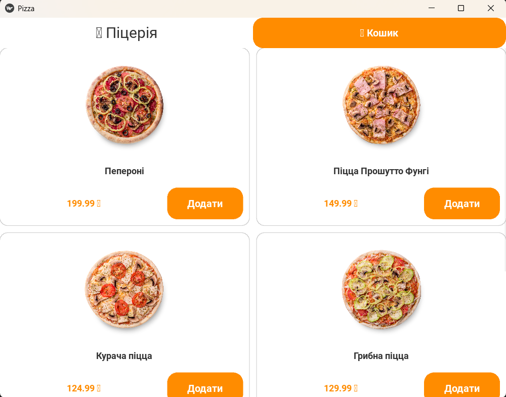

# 🍕Online pizzeria program in python

This application is able to order pizza through android application, the application itself was developed on kivy framework and Python programming language. Backend was developed on flask framework on python. Delivery tracker is available for courier. The application was converted to an APK file using the buildozer library, unfortunately it was only available on Linux and MacOs, so I had to use WSL, and the file compiled successfully.

## 📷photos and screenshots
Screenshot App:

## How does it work?:
There is a menu in front of you, you choose something, when you choose you select the category cart, you can remove pizzas, here are the prices and the total, then when you order you need to write down the form: name, surname, phone number and location, you can also choose the location on the map, when you order a request is made to the server and it writes the request to the database. This is the basic mechanism.

## Author:
- Slobodyanyuk Vyacheslav 2025
- [Contact us](mailto:slobodanukvaceslav8@gmail.com)
- [TikTok](https://www.tiktok.com/@ukrprogger3)
 - [Telegram Channel](https://t.me/ukrprogger)
